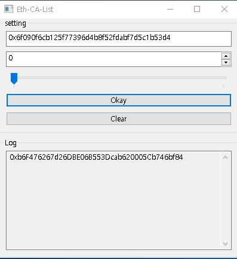

# Eth-CA-List
- Ethereum EOA의 CA를 미리 확인할 수 있습니다. 
- Ethereum EOAのCAを事前に確認することができます。

# How
- 1.EOA 입력. 
- 1.EOAを入力。
- 2. Tx Nonce값 입력. 
- 2. TX Nonceを入力。
- 3. OK Click. 
- 4.CA 출력.
- 4.CAが表示される。

# IMG

